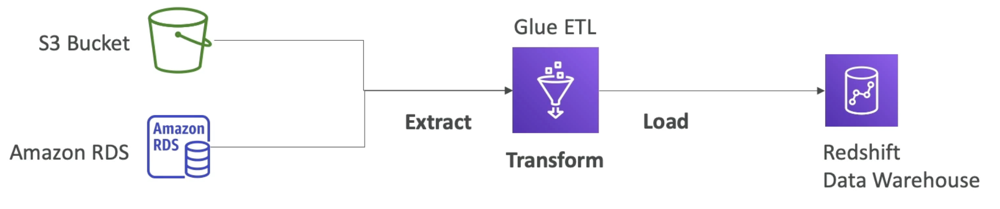
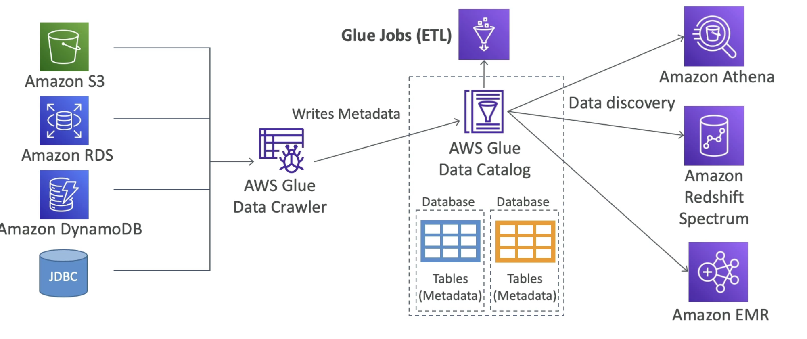

- Manage, extract, transform and load (ETL) service
- Useful to prepare and transform data for analytics
- Fully __serverless__ service
- Glue Job Bookmarks: prevent re-processing of old data
- Glue Elastic Views
	- Combine and replicate data across multiple data stores using SQL
	- No custom code, Glue monitors for changes in the source data, serverless
	- Leverages a "virtual table" (materialized view)
- Glue DataBrew: clean and normalize data using pre-built transformation
- Glue Studio: new GUI to create, run and monitor ETL jobs in Glue
- Glue Streaming ETL (built on Apache Spark Structured Streaming): compatible with [[Kinesis Data Streams]], Kafka, MSK (managed Kafka)

## Glue Data Catalog
---

