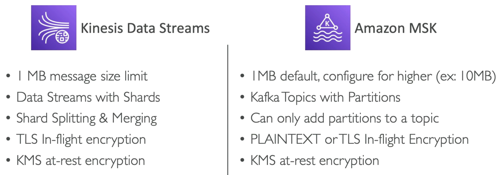

- MSK stands for Managed Streaming for [Kafka](https://kafka.apache.org/)
- Alternative to [[Kinesis]]
- Fully managed Apache Kafka on AWS
	- Allow you to create, update, delete clusters
	- MSK creates & manages Kafka brokers nodes & [Zookeeper](https://zookeeper.apache.org/) nodes for you
	- Deploy the MSK cluster in you [[VPC (Virtual Private Cloud)]], multi-[[AZ (Availability Zone)]] (up to 3 for High Availability)
	- Automatic recovery from common Kafka failures
	- Data is stored on [[EBS (Elastic Block Storage)]] volumes for as long as you want
- MSK Serverless
	- Run Kafka on MSK without managing capacity
	- MSK automatically provisions resources and scales compute & storage

## MSK vs Kinesis
---

