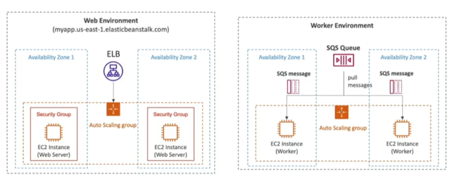

- Developer centric view of deploying an application on AWS
- Uses the same components we've seen before
- Managed service
	- Handles capacity provisioning, load balancing, scaling, application health monitoring, instance configuration
	- Just the application code is the responsability of the developer
- Still have full control over the configuration
- Beanstalk is free but you pay for the underlying services/instances

## EB Components
---
- __Application__ -> Collection of EB components (environments, versions, configurations, etc...)
- __Application Version__ -> an iteration of your application code
- __Environment__
	- Collection of AWS resources running an application version (only one application at a time)
	- Tiers -> Web Server Environemnt Tier & Worker Environment Tier
		- You can create multiple environments (dev, test, prod, ...)

## Web Server Tier vs. Worker Tier
---
