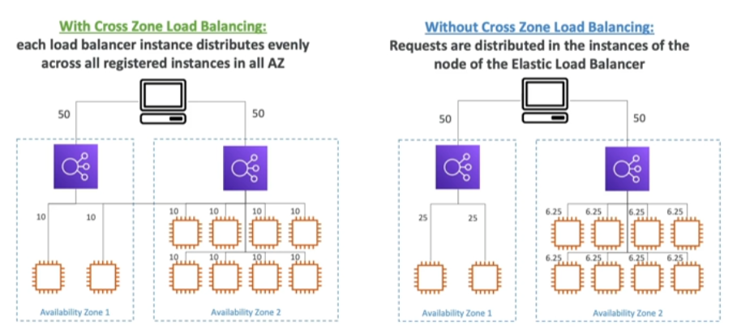

This is a configuration that is available for [[ELB (Elastic Load Balancer)]] that are in different [[AZ (Availability Zone)]], there's two configurations possible:

## Differences by Load Balancer type
---
- Application Load Balancer
	- Enabled by default (can be disabled at the Target Group Level)
	- No charges for inter [[AZ (Availability Zone)]] data
- [[NLB (Network Load Balancer)]] && [[GLB (Gateway Load Balancer)]]
	- Disabled by default
	- You pay charges for inter [[AZ (Availability Zone)]] data if enabled
- Classic Load Balancer
	- Disabled by default
	- No charges in case X-Zone is enabled