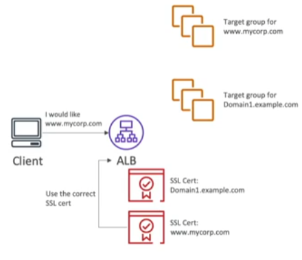

To make connections more secure, you can configure SSL/TLS certificates into the [[ELB (Elastic Load Balancer)]]
When traffic comes from the internet to the Load Balancer, it reaches as an HTTPS request, the load balancer then makes a SSL Certificate termination and redirects the traffic inside the [[VPC]] as an HTTP request, since the VPC is private, this process is secure.

- ELB uses an X.509 certificate (SSL/TLS server certificate)
- You can manage certificates using [[Certificate Manager (AMC)]]
- You can also create and upload your own certificates
- HTTPS listener:
	- Must specify a default certificate
	- Can add an optional list of certs to support multiple domains
	- Clients can use SNI (Server Name Indication) to specify the hostname they reach
	- Specify a security policy to support older versions of SSL/TLS (legacy clients)

## SNI (Server Name Indication)
---
- Solves the problem of loading __multiple SSL certificates onto one web server__
- Requires the client to indicate the hostname of the target server in the SSL handshake
- Only works for [[Application Load Balancer (ALB)]], [[Network Load Balancer (NLB)]] and [[Cloudfront]]

- Classic Load Balancer (v1) only supports one SSL certificate and must use multiple instances of CLB for multiple hostname with multiple SSL certificates
