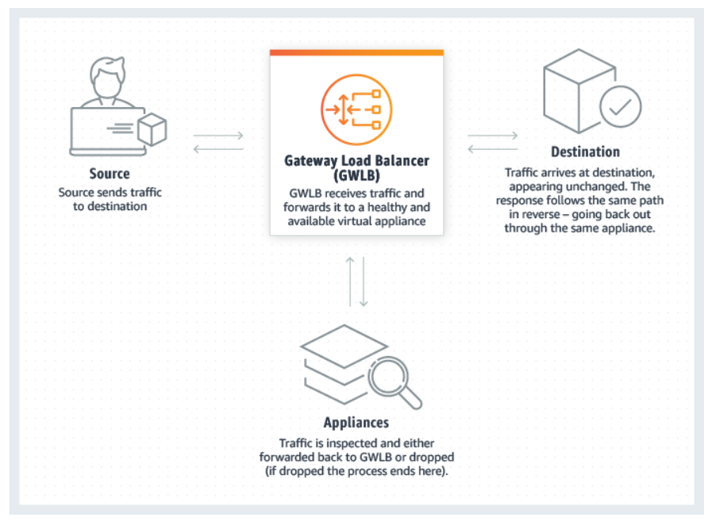
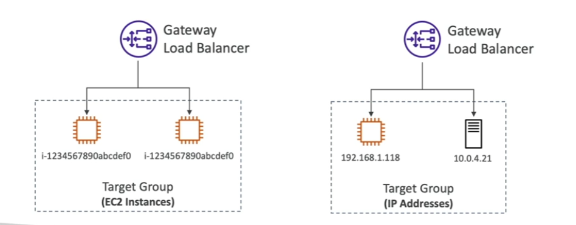

Type of [[ELB (Elastic Load Balancer)]]
- Deploy, scale and manage a fleet of 3rd party network virtual appliances in AWS
	- Example: Fireawalls, Intrusion Detection and Prevention Systems, Deep Packet Inspection Systems, payload manipulation, etc...
- Operates at [Layer 3](https://en.wikipedia.org/wiki/Application_layer) (Network Layer) - IP Packets
- Main functions:
	- __Transparent Network Gateway__ - single entry/exit for all traffic
	- __Load Balancer__ - distributes traffic to your virtual appliances
- Uses __GENEVE__ protocol on port 6081
## Target Groups
---
- EC2 instances 
- IP addresses - must be private IPs
