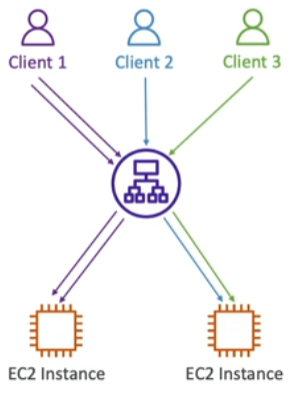

It's possible redirect the same client to the same server behind a load balancer, this is configured via the target group __attributes__ configuration.

- Enabled to Classic Load Balancer, [[ALB (Application Load Balancer)]], [[NLB (Network Load Balancer)]]
- The "cookie" used for stickiness has an expiration date you can control.
- Use case: make sure the user doesn't lose session data
- Enabling stickiness may bring imbalance to the load over the EC2 instances

## Cookie Names
---
- Application-based Cookies
	- Application cookie
		- Generated by the load balancer
		- Cookie name is __AWSALBAPP__
	- Custom cookie
		- Generated by the target
		- Can include any custom attributes required by the application
		- Cookie name must be specified individually for each target group
		- Don't use __AWSALB__, __AWSALBAPP__ or __AWSALBTG__ which are reserved for use by the ELB
- Duration-based Cookies
	- Cookie generated by the load balancer
	- Cookie name is __AWSALB__ for ALB, __AWSELB__ for CLB
