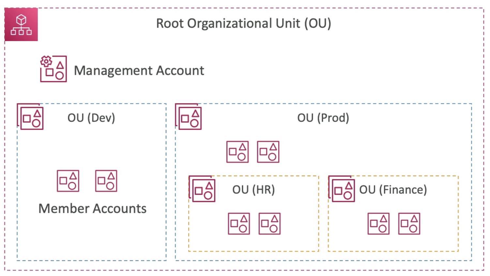

---
tags:
  - Security
---
- Global Service
- Allows to manage multiple AWS accounts 
- The main account is the management account
- Other accounts are member accounts
- Member accounts can only be part of one organization
- Consolidated Billing Acrosss all accounts - single payment method
- Pricing benefits from aggregated usage (volume discount for [[EC2 (Elastic Compute Cloud)]], [[S3]], etc...)
- _Shared reserved instances and Savings Plans_ discounts across accounts
- API is available to automate AWS account creation
- AWS Organizations are divided by Organization Units (OU), which are groups of AWS accounts with different purposes

- Advantages
	- Multi account vs One Account Multi [[VPC]]
	- Use tagging standards for billing purposes
	- Enable [[CloudTrail]] on all accounts, send logs to central S3 account
	- Send [[CloudWatch Logs]] to centras logging account
	- Establish Cross Account [[IAM]] Roles for Admin purposes
- Security: Service Control Policies (SCP)
	- IAM policies applied to Organization Unit (OU) or Accounts to restrict Users and Roles
	- SCPs are treated as default policies for all accounts inside their OU, but they can be overwritten by specific policies attached to a specific account
	- They do not apply to the management account (full admin power)
	- Must have an explicit allow (less privilege paradigm)