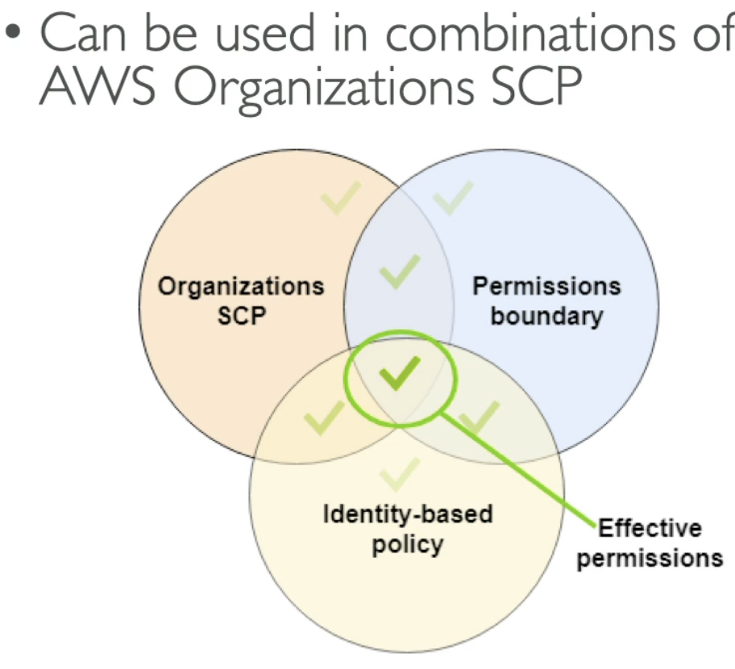

## [[IAM]] Permission Boundaries
---
- IAM permission boundaries are supported for users and roles (not groups)
- Advanced feature used to set the maximum permissions an IAM entity can get 
- Can be used in combination with [[AWS Organizations]] SCP

- Use cases
	- Delegate responsabilities to non administrators within their permission boundaries, for example create new IAM users
	- Allow developers to self-assign policies and manage their own permissions, while making usre they can't escalate their privileges (e.g.: make themselves an admin user)
	- Useful to restrict one specific user (instead of a whole account using Ornizations & SCP)