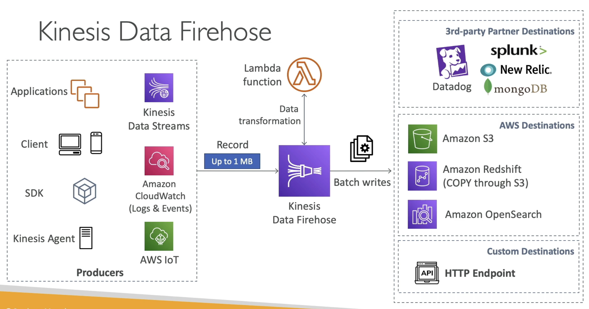
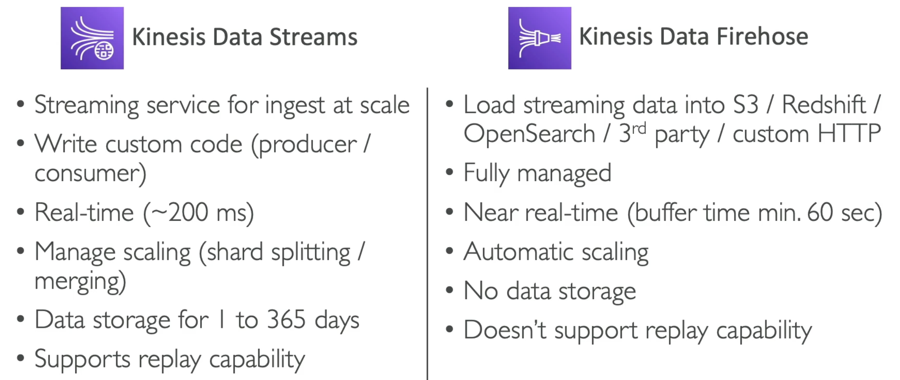

Data Firehose is a [[Kinesis]] service that loads and transforms data streams into data stores

## Data Firehose Flow
---

- __Producers__ sends records to Kinesis Data Firehose endpoint
- Optionally, the records can be transformed via a [[AWS Lambda]] function
- Firehose batch writes to a __Consumer__ which can be AWS Destinations, 3rd-party Partner Destinations and Custom Destinations

## Attributes
---
- Fully managed service, no administration, automatic scaling, serverless
	- AWS: [[RedShift]], [[S3]], [[OpenSearch]]
	- 3rd-party Partner: Splunk, MongoDB, DataDog, NewRelic, etc...
	- Custom: send to any HTTP endpoint
- Pay for data going through Firehose
- Near real time
	- 60 seconds latency minimum for non full batches
	- Or minimum 1MB data at a time
- Supports many data formats, conversions, transformations, compression
- Supports custom data transformations using AWS Lambda
- Can send failed or all data to a backup S3 bucket

## Kinesis Data Streams vs  Firehose
---
