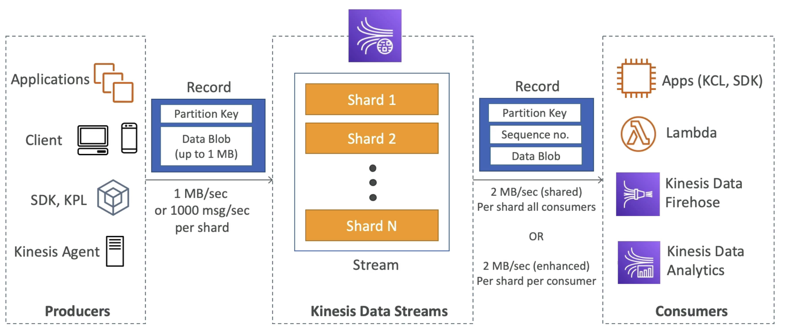
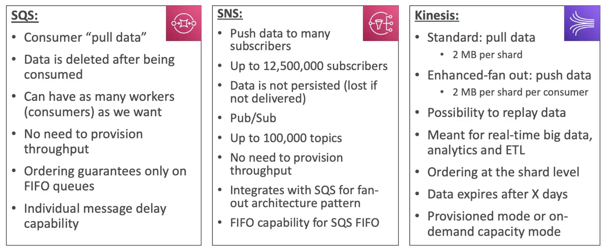

This is a [[Kinesis]] service that captures, processes and stores data streams

- Retention between 1 to 365 days
- Ability to reprocess (replay) data
- Once data is inserted in Kinesis, it can't be deleted (immutability)
- Data that shares the same partition goes to the same shard (ordering)
- Producers
	- AWS SDK
	- Kinesis Producer Library (KPL)
	- Kinesis Agent
- Consumers
	- Write your own: Kinesis Client Library (KPL), AWS SDK
	- Managed: [[AWS Lambda]], [[Kinesis Data Firehose]], [[Kinesis Data Analytics]]
## Shards
---
- Shards are the "parts" of the Kinesis Data Streams data store, the number of shards defines the thoughput of data stores.
- Each Shard of a store gets a partition key
- There's 2 capacity modes that scales Shards
	1. Provisioned Mode
		- You choose the number of shards provisioned, manually scaled or using an API
		- Each shard gets 1MB/s in (or 1.000 records per second)
		- Each shard gets 2MB/s out (classic or enhanced fan-out consumer)
		- You pay per shard provisioned per hour
	2. On-demand Mode
		- No need to provision or manage the capacity
		-  200MB/s in (or 200.000 records per second)
		- Default capacity provisioned (4MB/s in or 4.000 records per second)
		- Scales automatically based on observed throughput peak during last 30 days
		- Pay per stream per hour & data in/out per GB
- The maximum amount of consumers is defined by the number of shards

## Records
---
- When Producers sends messages to the store they are defined by
	- Partition key: Defines in which Shard the message is stored
	- Data Blob: The data content, maximum of 1MB
- When the Store sends messages to the Consumers they are defined by
	- Partition key: Defines in which Shard the message is stored
	- Sequence number: Defines where in the Shard the message is stored
	- Data Blob: The data content, maximum of 1MB

## Security
---
- Kinesis Data Stream is deployed in a specific [[AWS Region]]
- Control access / authorization using [[IAM]] policies
- Encryption in flight using HTTPS endpoints
- Encryption at rest using [[KMS (Key Management Service)]]
- You can implement encryption/decryption of data on client side (harder)
- [[VPC]] Endpoints available for Kinesis to access within VPC
- Monitor API calls [[CloudTrail]]

## SQS vs SNS vs Kinesis
---
