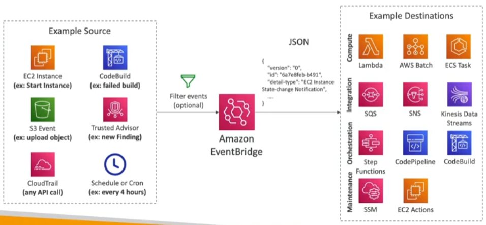

---
tags:
  - Monitoring
---
- Formerly know as CloudWatch Events
- Schedule: Cron jobs (scheduled scripts)
- Event Pattern: Event rules to react when a service does something

## EventBridge Rules
---

## Source Types
---
1. Default: AWS Services
2. Partner Event Bus: AWS SaaS Partners (e.g.: Datadog, Zendesk, etc...)
3. Custom Event Bus: Custom Apps
- Event buses can be accessed by other AWS accounts using Resource-based [[IAM]] Policies
- You can __archive events__ (all/filter) sent to an event bus (indefinitely or set period)
- Ability to replay archived events

## Schema Registry
---
- EventBridge can analyze the events in your bus and infer the schema
- The __Schema Registry__ allows you to generate code for your application, that will know in advance how data is structured in the event bus
- Schemas can be versioned

## Resource-based Policies
---
- Manage permissions for a specific Event Bus
- Example: allow/deny events from another AWS account or [[AWS Region]]
- Use case
	- Aggregate events from your AWS Organization in a single AWS account or AWS Region