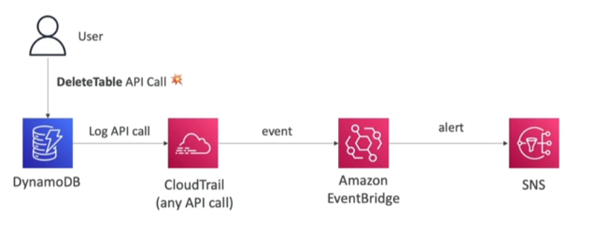
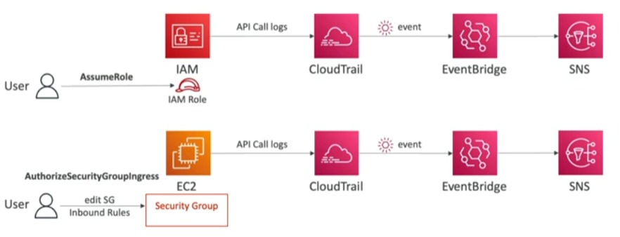

[[CloudTrail]] + [[AWS EventBridge]] integration are a important pattern to use while applying governance and identifying and acting on AWS management anomalies

## Examples
---
### Intercept API Calls

### IAM Services

