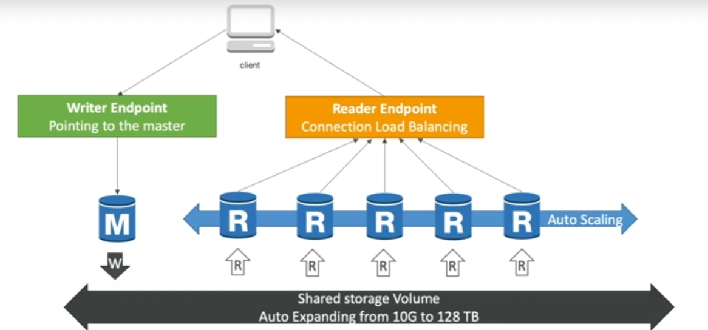
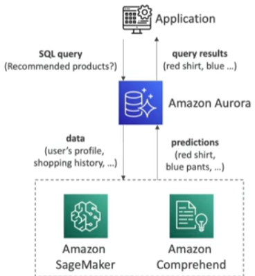

---
tags:
  - Storage
---
- Proprietary [[RDS (Relational Database Service)]] database engine from AWS
- Postgres and MySQL are both supported as Aurora DB (driver will work as if Aurora was a Postgres or MySQL database)
- Cloud optimized (5x performance improvement over MySQL on RDS, 3x performance of Postgres on RDS)
- Automatic vertical storage scaling, with steps of __10GB__, up to __128TB__
- Can have up to 15 [[RDS Read Replicas]] and replication process is faster than MySQL (sub 10ms replica lag)
- Failover is instantaneous
- Aurora costs more than RDS (20% more) - but it's more efficient

## High Availability and Read Scaling
---
- By default 6 copies of your data across 3 [[AZ (Availability Zone)]]s
	- 4 copies out of 6 needed for writes
	- 3 copies out of 6 need for reads
	- Self healing with peer-to-peer replication
	- Storage is striped across 100s of volumes
- One aurora instance takes writes )master
- Automated failover for master in less than 30 seconds
- Master + up to 15 aurora read replicas serve reads
- Support for Cross-[[AWS Region]] replication

## DB Cluster
---

## Advanced Services
---
- Auto Scaling on reader endpoint instances
- Custom endpoints
	Define a subset of Aurora instances as Custom endpoint
	Example: running analytical queries on specific replicas
	The reader endpoint is generally not used after defining custom endpoints
- Aurora Serverless
	- Automated DB instantiation and auto-scaling based on actual usage
	- Good for infrequent, intermittent or unpredictable workload
	- No capacity planning needed
	- Pay per second, can be more cost-effective
- Aurora Multi-Master
	- If you ant continuous write availability for writer nodes
	- Every node des R/W - vs promoting a [[RDS Read Replicas]] as the new master
- Aurora Global Database (recommended)
	- 1 primary [[AWS Region]]
	- Up to 5 secondary regions, replication lag is less than 1 second
	- Up to 16 read replicas per secondary region
	- Helps for decreasing latency
	- Promoting another region (for disaster recover) has an RTO(Recovery Time Objective) of < 1 minute
	- Typical cross-region replication takes less than 1 second
- Aurora Machine Learning
	- Enables to add ML-based predictions to your applications via SQL
	- Simple, optimized, secure integration between Aurora and AWS ML services
	- Supported services
		- Amazon SageMaker (use with any ML model)
		- Amazon Comprehend (for sentiment analysis)
	- Use cases: fraud detection, ads targeting, sentiment analysis, product recommendations
