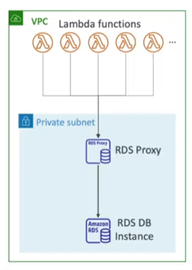

RDS Proxies helps with [[Relational Database Service (RDS)]] performance, especially when the database receives lots of connections

- Fully managed database proxy for RDS
- Allows apps to pool and share DB connections established with the DB
- Improves DB efficiency by reducing stress on resources (CPU, RAM) and minimize open connections (and timeouts consequently)
- Serverless, autoscaling, highly available (multi-[[Availability Zone (AZs)]])
- Reduced RDS & Aurora failover time by up to 66%
- No code changes required for most apps
- Enforce [[IAM]] authentication for DB and securely store credentials in [[AWS Secrets Manager]]
- RDS Proxy is never publicly accessible (only accessed from a [[VPC]])
