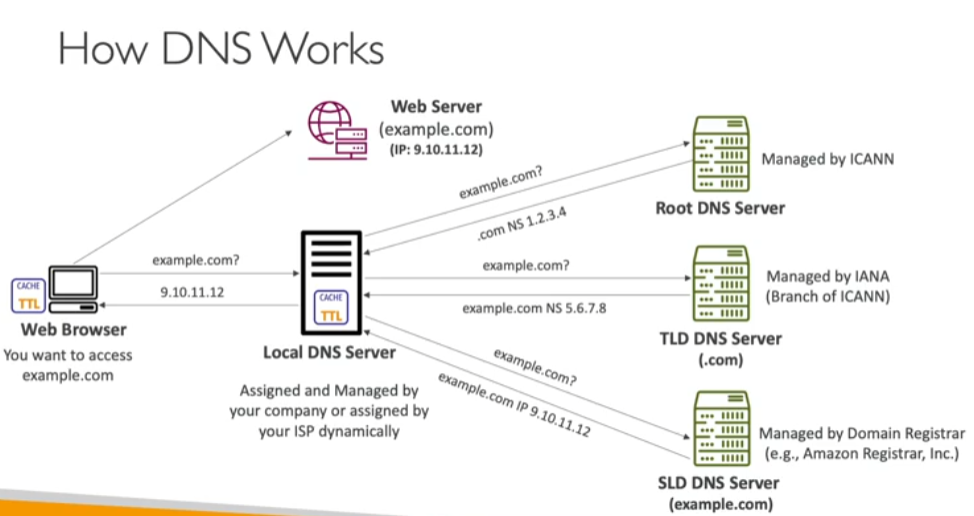

---
tags:
  - Network
---
- Domain Name System (DNS) translates human friendly hostnames into the machine IP addresses
- DNS is the backbone of the internet

- Domain Registrar: Registers new domain names, e.g. Amazon Route53, GoDaddy, etc...
- DNS Records: A, AAAA, CNAME, NS, etc...
- Zone file: contains the DNS records
- Name server: resolves DNS queries (Authoritative or Non-Authoritative)
- Top Level Domain (TLD): `.com` , `.us`, `.gov`, `.org` , etc...
- Second Level Domain (SLD): `amazon.com`, `google.com`, etc...
