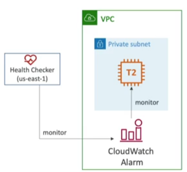

Mechanism to check health of AWS resources

- Protocols supported: HTTP, HTTPS, TCP
	- HTTP health checks are only for public resources 
- Associate Health Check with [[Route53]] gives us some capabilities such as:
	- Automated DNS Failover in case a resource is deemed unhealthy
- Types of health checks
	1. Monitor an endpoint (application, server, other AWS resource)
	2. Monitor other health checks (Calculated Health Checks)
	3. Monitor [[CloudWatch]] Alarms (which gives much more control) - e.g. throttles of Dynamo DB, alarms on RDS, custom metrics, etc...
- Health checks are integrated with CloudWatch

## Monitor an Endpoint
---
- 15 Health Checks are used to check endpoint health
	- Customize healthy/unhealthy threshold (default 3)
	- Supported protocols: HTTP, HTTPS, TCP
	- If > 18% of health checkers report the endpoin is __Healthy__. Otherwise, it's __Unhealthy__
	- Ability to choose which locations Route53 uses
- Health check only passes when the endpoint responds with 2xx or 3xx status code
- Health checks can be setup to pass/fail based on the text in the first __5120 bytes__ of the response
- Configure router/firewall to allow incoming requests from Route53 Health Checkers IP ranges (which can be checked in this [link](https://ip-ranges.amazonaws.com/ip-ranges.json))

## Calculated Health Checks
---
- Combines the results of multiple health checks into a single health check
- You can use __OR__, __AND__ or __NOT__
- Can monitor up to 256 Child Health checks  
- Specify how many health checks need to pass to make the parent pass
- Usage
	- Perform maintenance to your website without causing all health checks to fail

## Monitor CloudWatch Alarm
---
Route53 Health Checkers are external to your [[VPC (Virtual Private Cloud)]], so they can't access __private__ endpoints, but you can create a CloudWatch Metric and associate it to a CloudWatch Alarm, then create a Health Check that monitors the alarm itself.

## Failover
---
With Health Checks, it's possible to create a disaster recovery instance in case a primary resource is deemed unhealthy