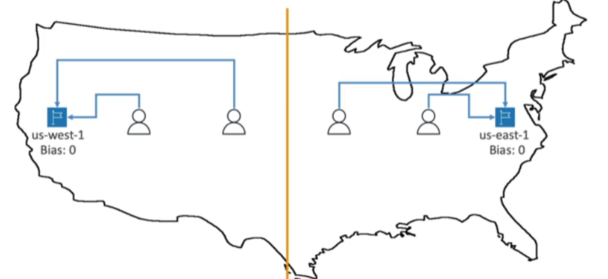
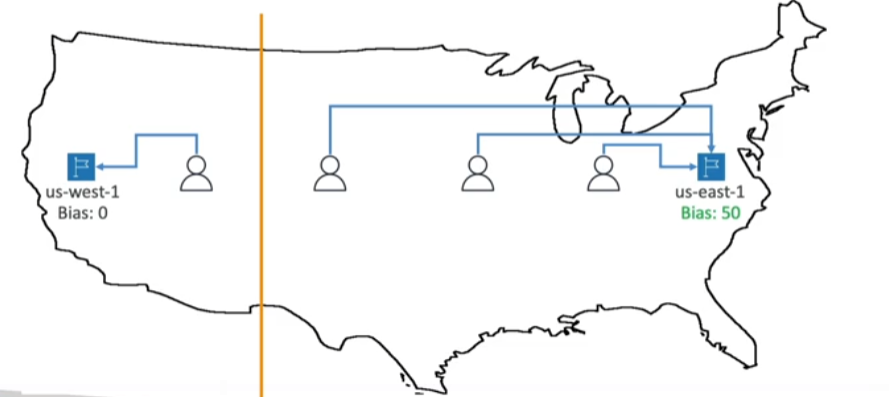

- Define how [[Route53]] responds to DNS queries
- Don't get confused by the word "_Routing_"
	- It's not the same as a Load Balancer routing which routes traffic
	- DNS does not route traffic, it only responds to DNS queries

## Simple
---
Typically DNS records "routes" traffic to a single resource, but for simple routing policies, multiple values can be specified.
- If multiple values are returned, a random one is chosen by the __client__
- When Alias is enabled, specify only one AWS resource
- Can't be associated with Health Checks

## Weighted
---
- Control the % of the requests that go to each specified resource
- Assign each record a relative weight
	- Weights don't have to sum up to 100 !
$$	traffic(\%) = \frac{weight\ for\ specified\ record}{sum\ of\ all\ weights\ for\ all\ records} $$
- DNS records must have the same name and type
- Can be associated with Health Checks
- Use cases
	- Load balance between regions
	- Test new application versions
- Assign a weight of 0 to a record to stop sending traffic to a resource
	- If all records have weight of 0, then all records will be returned equally

## Latency
---
- Redirect to resource that has the __least latency__ based on user current location (not geographic one, but the "virtual" one, so VPNs can be used to test that)
- Super helpful when latency for users is a priority
- Latency is based on traffic between users and [[AWS Region]]
- Can be associated with Health Checks (has failover capabilities)

## Geolocation
---
- This policy responds to requests based __ONLY__ on user current location
- Specify location by Continent, Contry or by US State (if there's overlapping, most precise location is sleected)
- Should create a "Default" record (in case there's no match on location)
- Use cases
	- Website localization
	- Restrict content distribution
	- Load balancing
- Can be associated with Health Checks (has failover capabilities)

## Geoproximity
---
- Routes traffic to resources based on the geographic location of users and resources weighted by a __bias__ variable
- To change the size of the geographic region that attracts/repels traffic, you specify a __bias__ variable
	- To attract (1 to 99) -> more traffic to resources
	- To repel (-1 to -99) -> less traffic to resources
- Resources can be
	- AWS resources (specified by [[AWS Region]])
	- Non-AWS resources (specify Latitude and Longitude) 
- Must use Route53 Traffic Flow to use this feature

## IP based
---
- Routing based on client's IP addresses
- Provide a list of CIDRs for clients and corresponding endpoints/locations (user IP to endpoint mappings)
- Use cases
	- Optimize performance
	- Reduce network costs
- Example: route end users from a particular ISP to a specific endpoint

## Multi-Value
---
- Can be associated with health checks (return only values that are healthy)
- Used when routing traffic to multiple resources
- Up to 8 healthy resources can be returned
- Multi value is not a substitute for an [[ELB (Elastic Load Balancer)]]