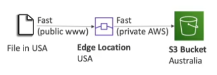

## Baseline Performance
---
- Amazon [[S3]] automatically scales to high request rates, latency of 100-200ms
- Your application can achieve at least 3.500 PUT/COPY/POST/DELETE or 5.500 GET/HEAD requests per second per prefix in a bucket
- No limits of prefixes in a bucket

## Performance Optimizations
---
- Multi-part upload
	- recomendded for files > 100MB and must use for files > 5 GB
	- Can help paralleliza uplaods (speed up transfer)
- S3 Transfer Acceleration
	- Increase transfer speed by transferring file to an AWS edge location which forward data to S3 bucket in the target region
	- Compatible with multi-part upload

- S3 Byte-Range Fetches
	- Parallelize GETs by requesting specific byte ranges
	- Better resilience in case of failures
	- Use cases
		- Speed up downloads
		- Retrieve only partial data (e.g.: head of a file)

-  S3 Select & Glacier Select
	- Retrieve less data from [[S3]] using SQL by performing __server-side filtering__
	- Can filter by rows & columns (simple SQL statements)
	- Less network transfer, less CPU cost client-side
	- Up to 400% and 80% cheaper