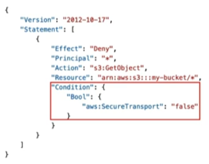

[[S3 (Simple Storage Service)]] objects can be encrypted both via Server-Side Encryption (SSE) and Client-Side Encryption

## SSE with Amazon S3 Managed Keys (SSE-S3)
---
- Encrypts objects using keys handled, managed and owned by AWS
- Object is encrypted server-side
- Encryption type is __AES-256__
	- Must set header `"x-amz-server-side-encryption":"AES256"
- Enabled by default for new buckets & new objects

## SSE with AWS KMS keys (SSE-KMS)
---
- Encrypts objects using keys handled, managed and owned by AWS [[KMS (Key Management Service)]]
- User control + audit key usage using [[CloudTrail]]
- Object is encrypted server-side
- Must set header `"x-amz-server-side-encryption":"aws:kms"

### SSE-KMS Limitations
- May be impacted by the KMS limits since we're using the KMS API in requests
	- When you upload, it calls the __GenerateDataKey__ KSM API
	- When you download, it calls the __Decrypt__ KSM API
	- Count towards the KMS quota per second (which is based on [[AWS Region]])
		- Can request quota increase using the Service Quotas Console

## SSE with Client Provided Keys (SSE-C)
---
- Server-Side Encryption using keys fully managed by the customer outside AWS
- AWS does NOT store the encryption key provided
- HTTPS must be used
- Encryption key must be provided in HTTP headers, for __EVERY__ HTTP request made

## Client-Side Encryption
---
- Use client libraries such as Amazon S3 Client-Side Encryption library
- Client must encrypt data before sending to S3
- Client must decrypt data themselves when retrieving from S3
- Customer fully manages the keys and encryption cycle

## Encryption in transit (SSL/TLS)
---
- Encryption in flight is also called SSL/TLS
- S3 exposes two endpoints
	1. HTTP endpoint - non encrypted
	2. HTTPS endpoint - encryption in flight
- HTTPS is recommended
- HTTPS is mandatory for SSE-C
	- Although most clients use HTTPS by default
- You can force SSL/TLS via a [[IAM]] bucket policy

## Default Encryption vs. Bucket Policies
---
- SSE-S3 encryption is the default
- Optionally, you can "force encryption" using a bucket policy and refuse API call to PUT an S3 object without encryption headers (SSE-KMS or SSE-C)
- Note: Bucket policies are evaluated before "Default Encryption"