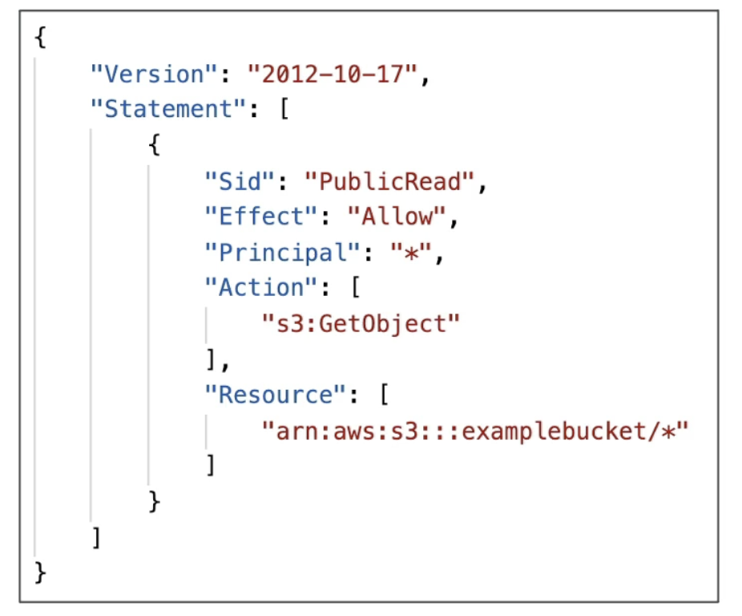

[[S3 (Simple Storage Service)]] security can be defined in several forms:
- User-based
	- [[IAM]] Policies: defined which API calls a specific user from IAM is allowed to do
- Resource-based
	- Bucket policies: bucket wide rules from S3 console, these policies also allow cross account access
	- Object Access Control List (ACL): finer grain (can be disabled)
	- Bucket Access Control List (ACL): less common (can be disabled)
- Encryption-based
	- Encrypt objects from bucket using encryption keys

- __NOTE__: IAM Principals can access S3 object these conditions are met:
	- The IAM user permissions __ALLOW__ it __OR__ the resource policies __ALLOW__ it
	- There's no explicit __DENY__

## Bucket Policies
---
- JSON formatted policies
	- Resource: buckets and objects
	- Effect: Allow / Deny
	- Actions: Set of API requests to Allow or Deny
	- Principal: The account or user the policies applies to
- Use S3 bucket policy to 
	- Grant public access to the bucket
	- Force objects to be encrypted at upload
	- Grant access to another account (Cross Account Access)
	 

	
### Block Public Access
- This coniguration is an extra layer of security which takes precedence the other settings we saw earlier
- These settings were created to prevent company data leaks
- If you know a bucket should never be public, leave this on
- Can be set at the account level
