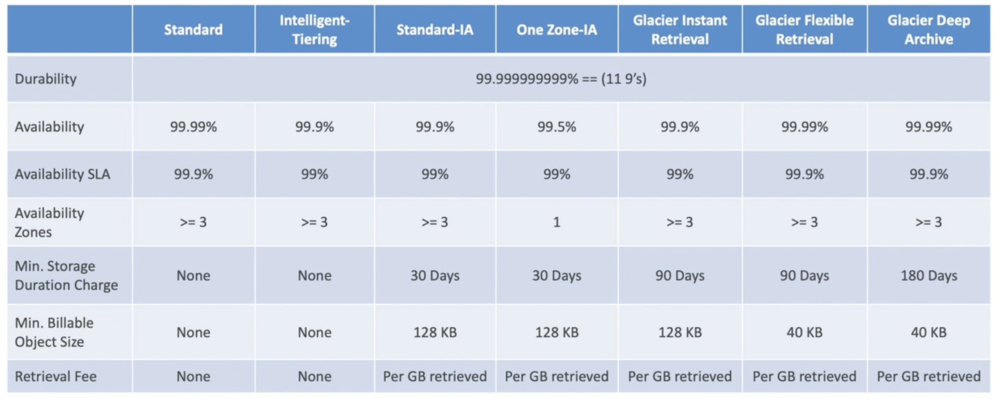

[[S3]] has different types of storage classes
- Amazon S3 Standard - General Purpose
- Amazon S3 Standard-Infrequent Access (IA) 
- Amazon S3 One Zone-Infrequent Access (IA)
- Amazon S3 Glacier Instant Retrieval
- Amazon S3 Glacier Flexible Retrieval
- Amazon S3 Glacier Deep Archive
- Amazon S3 Intelligent Tiering

It's possible to move a bucket class manuallt or in the bucket lifecycle

## Availability and Durability
---
- Durability 
	- High (99.99999999999%) of objects across multiple [[Availability Zone (AZs)]]
	- If you store 10M objects in Amazon S3, on average you expect to incur loss of a single object every 1000 years
	- Same for all storage classes
- Availability
	- Measures how readily the bucket is
	- Varies depending on storage class
		- E.g.: Standard has 99.99% availability = not available for 53 minutes a year

## Standard - General Purpose
---
- 99.99% Availability
- Used for frequently accesse data
- Low latency and high throughput
- Sustain 2 concurrent facility failures
- Use cases
	- Big Data Analytics
	- Mobile & Gaming applications
	- Content Distribution

## Infrequent Access
---
- Data that is accessed infrequently, but requires rapid access when needed
- Lower cost than S3 Standard, but has higher access costs
### Standard IA
- 99.9% availability
- Use cases
	- Disaster Reovery
	- Backups

### One Zone IA
- High durability (99.999999999%) in a single AZ, data lost when AZ is destroyed
- 99.5% availability
- Use cases
	- Storing secondary backup copies of on-premises data or data you can recreate

## Glacier Storage Classes
---
- Meant for achiving and backup
- Pricing: price for storage + object retrieval cost

### Instant Retrieval
- Milisecond retrieval, great for data accessed once a quarter
- Minimum storage duration of 90 days

### Flexible Retrieval
- Many types of tiers
	- Expedited (1 to 5 minutes)
	- Standard (3 to 5 hours)
	- Bulk (5 to 12 hours) - free
- Minimum storage duration of 90 days

### Deep Archive - for long term storage
- Many type of tiers
	- Standard (12 hours) 
	- Bulk (48 hours)
- Minimum storage duration of 180 days

## Inteligent-Tiering Class
---
- Moves objects automatically between Access Tiers depending on usage
- Small monthly monitoring and auto-tiering fee
- There are no retrieval charges in S3 Inteligent-Tiering
- Rules for moving objects
	- Frequent Access (automatic) - default tier
	- IA (automatic) - objs not accessed for 30 days
	- Archive IA (automatic) - objs not accessed for 90 days
	- Archive Access (optional) - configurable from 90 to 700+ days
	- Deep Archive (optional) - configurable from 180 to 700+ days

More on pricing check [this link](https://aws.amazon.com/s3/pricing)