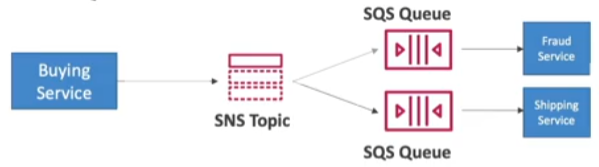

- Push once in [[Simple Notification Service (SNS)]], receive in all [[Simple Queue Service (SQS)]] queues that are subscribers
- Fully decoupled, no data loss
- SQS allows
	- Data persistence
	- Delayed processing
	- Retries of work
- Ability to add more SQS subscribers over time
- Make sure your SQS __access policy__ allows for SNS to write
- Cross [[AWS Region]] delivery: works with SQS queues in other regions
  