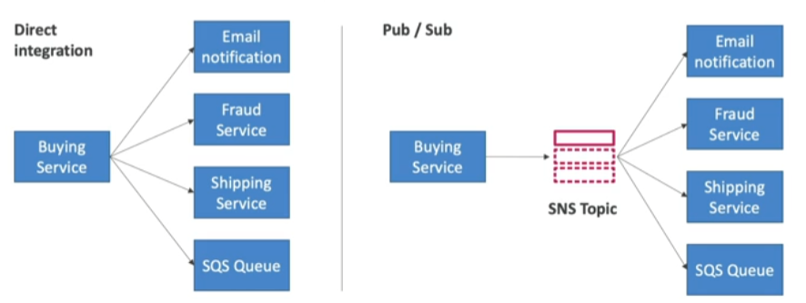

SNS is another kind of __asynchronous__ integration between applications, but it differs from [[Simple Queue Service (SQS)]] because it uses the __Publisher/Subscriber__ pattern and the latter uses __Direct Integration__

- The "event producer" only sends messages to one __SNS topic__
- As many "event receivers" (subscriptions) as we want to listen to the SNS topic notifications
- By default each subscriber to the topic will get all the messages
	- You can also filter the received messages
- Up to 12.500.000 subscriptions per topic
- 100.000 topic limit

## How to publish
---
Many AWS services can send data directly to SNS for notifications
- Topic publish (using the SDK)
	- Create a topic
	- Create a subscription (or many)
	- Publish the topic
- Direct Public (for mobile apps SDK)
	- Create a platform application
	- Create a platform endpoint
	- Publish to the platform endpoint
	- Works with Google GCM, Apple APNS, Amazon ADM, etc...

## Security
---
- Encryption
	- In-flight encryption using HTTPS API
	- At-rest encryption using KMS keys
	- Client-side encryption if the client wants to perform encryption/decryption itself
- Access Controls: [[IAM]] policies regulates access to SNS API
- SNS Access Policies (similiar to [[S3]] policies)
	- Useful for cross-account access to SNS topics
	- Useful for allowing other services ([[S3]], [[AWS Lambda]], etc...) to write an SNS topic
