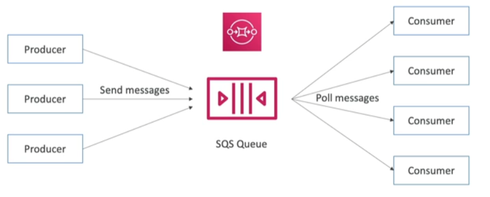

## Queue Services
---
Mechanism do __decouple__ services by integrating them __asynchronously__, they are composed of _Producers_ which sends messages to the Queue Service and _Consumers_ which poll these messages and process them.

## Standard Queue
---
- Oldest offering (over 10 years old)
- Fully managed service, used to __decouple applications__
- Unlimited throughput, unlimited number of messages in queue
- Default retention of messages: 4 days, up to a maximum of 14 days
- Low latency (<10ms or publish and receive)
- Limitation of 256KB per message sent
- Can have duplicate messages (at least once delivery, occasionally)
- Can have out of order messages (best effort offering)

## Producing Messages
---
- Produced to SQS using the SDK (SendMessage API)
- The message is persisted in SQS until a consumer deletes it
- Example: send an order to be processed
	- Order id
	- Customer id
	- Any attributes you want
- SQS standard
	- unlimited throughput

## Consuming Messages
---
- Consumers (running on [[EC2 (Elastic Compute Cloud)]] instances, servers, [[AWS Lambda]], etc...)
- Consumers can receive and process messages in parallel
- At least once delivery
- Best-effort message ordering
- Consumers delete messages after processing them
- We can scale consumers horizontally to improve processing throughput

## SQS with [[EC2 Auto Scaling Groups (ASG)]]
---
- SQS doesn't has an inherent capability of controlling ASG, but it's easily integrated with [[CloudWatch]] metrics and alarms, which can be used to trigger ASG scaling capabilities

## Security
---
- Encryption
	- In-flight encryption using HTTPS API
	- At-rest encryption using [[KMS (Key Management Service)]] keys
	- Client-side encryption if the client wants to perform encryption/decryption itself
- Access Controls: [[IAM]] policies regulates access to SQS API
- SQS Access Policies (similiar to [[S3]] policies)
	- Useful for cross-account access to SQS queues
	- Useful for allowing other services ([[SNS (Simple Notification Service)]], S3, etc...) to write an SQS queue