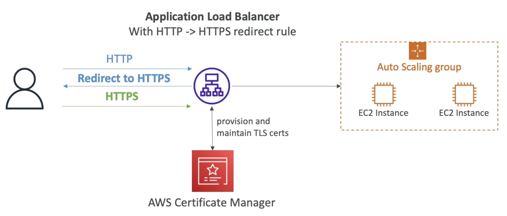

---
tags:
  - Security
---
- Easily provision, manage and deploy __TLS Certificates__
- Provide in-flight encryption for websites (HTTPS)
- Supports both public and private TLS certificates
	- Free for public
- Automatic TLS certificate renewal
- Integrations with
	- [[ELB (Elastic Load Balancer)]] (CLB, [[ALB (Application Load Balancer)]], [[NLB (Network Load Balancer)]])(load certificate)
	- [[CloudFront]] distributions
	- APIs on [[API Gateway]]
- Cannot use ACM with [[EC2 (Elastic Compute Cloud)]] (can't be extracted)

## Requesting a Public Certificate
---
1. List domain name to be included in the certificate
	- Fully Qualified Domain Name (FQDN): corp.example.com
	- Wildcard Domain: \*.example.com
2. Select validation method: 
	- DNS Validation
		- Preffered for automation purposes
		- Leverage a CNAME record to DNS config (ex: [[Route53]])
	- Email validation
		- Send emails to contact addresses in the WHOIS database
3. Take some hours to get verified
4. Public Certificate will be enrolled for automatic renewal
	- ACM automatically renews ACM-generated certificates 60 days before expiry

## Importing Public Certificates
---
- Option to generate the certificate outside of ACM and then import it
- No automatic renewal
- ACM sends daily expiration events (via [[AWS EventBridge]]) starting 45 days prior to expiration
	- \# of days can be configured
	- Events are appearing in EventBridge
- [[AWS Config]] has a managed rule named `acm-certificate-expiration-check` to check for expiring certificates (configurable number of days)

## Integration with ALB
---
- Use HTTP to HTTPS redict rule

## Integration with API Gateway
---
- Create a __Custom Domain Name__ in API Gateway
- Edge-Optimized [[API Gateway Endpoint Types]] (default)
	- For global clients
	- Requests are routed through  the [[Cloudfront]] Edge locations (improves latency)
	- API Gateway still lives in only one region
	- TLS Certificate must be in the same region as CloudFront (us-east-1)
	- Setup CNAME or A-Alias (better) record in Route53
- Regional
	- Clients in the same region
	- TLS Certificate must be imported on API Gateway, in the same region as the API stage
	- Setup CNAME or A-Alias (better) record in Route53