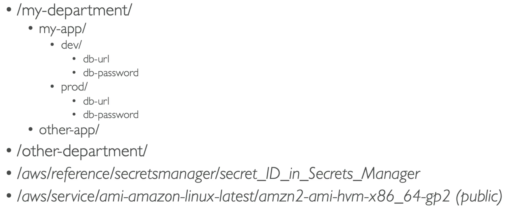

---
tags:
  - Security
---
- Secure storage for configuration and secrets (like Hashicorp's Vault)
- Optional Seamless Encryption using [[KMS (Key Management Service)]]
- Serverless, scalable, durable, easy SDK
- Version tracking of configurations / secrets
- Security through [[IAM]]
- Notifications with [[AWS EventBridge]]
- Integration with [[CloudFormation]]

## Store Hierarchy
---
- SSM Parameter Store has a "file-tree" like structure

## Parameter Policies
---
- Allow to assign a TTL to a parameter to force updating or deleting sensitive data such as passwords
- Can assign multiple policies at a time