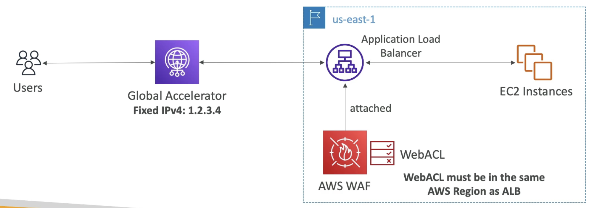

---
tags:
  - Security
---
- Protects your web applications from common web exploits (Layer 7 - HTTP)
- Deploy on
	- [[ALB (Application Load Balancer)]]
	- [[API Gateway]]
	- [[CloudFront]]
	- AppSync GraphQL API
	- [[Amazon Cognito]] User Pool
- Define Web ACL (Web Access Control List) Rules:
	- IP Set: up to 10.000 IP addresses per rule
	- HTTP headers, HTTP body or URI strings protects from common attacks (e.g.: SQL injection and Cross-Site Scripting (XSS))
	- Size constraint, geo-match (block countries)
	- Rate-based rules (to count occurences of events) - for DDoS protection
- Web ACL are Regional except for CloudFront
- A rule group is a reusable set of rules that you can attach to a web ACL

## Fixed IP while using WAF with a Load Balancer
---
- WAF does not support the [[NLB (Network Load Balancer)]] (which is Layer 4)
- We can use [[AWS Global Accelerator]] for fixed IP and WAF on the ALB
