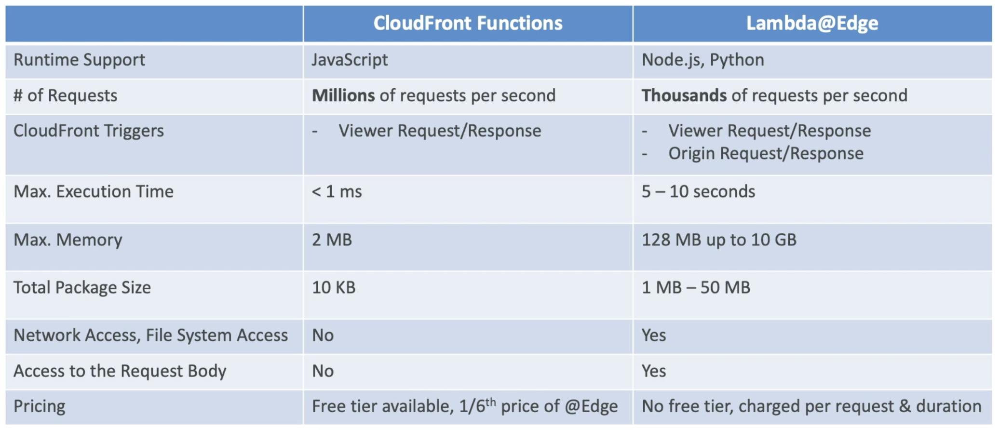

Many modern applicaions execute some form of logic at the __Edge Locations__ to reduce latency.

- Edge Function
	- Function attached to [[CloudFront]] distributions
		- Runs close to users and minimizes latency
- CloudFront provides two types
	1. CloudFront Functions
	2. Lambda@Edge
- Serverless
- Deployed globally
- Pay only for what you use
- Use case
	- Customize CDN content
	- Web Security and Privacy
	- Dynamic Web Application at the Edge
	- A/B Testing
	- User Authentication and Authorization
	- User Priorization
	- User Tracking and Analytics
	- Real-time Image Transformation
	- Bot Mitigation at the Edge
	- Intelligenly Route Across Origins and Data Centers
	- Search Engine Optimization (SEO)
	- etc...

## CloudFront Functions
---
- Written in JavaScript
- For high-scale, latency-sensitive CDN customizations
- Sub-ms startup times, millions of requests/second
- Used to change Viewer requests and responses
	- Viewer request: after CloudFront receives a request from a viewer
	- Viewer response: before CloudFront forwards the response to the viewer
- Native feature of CloudFront (manage code entirely within CloudFront)
- Use cases
	- Cache key normalization
		- Transform request attributes to create optimal Cache Key
	- Header manipulation
		- Insert/modify/delete HTTP headers in the request or response
	- URL rewrites or redirects
	- Request authentication & authorization
		- Create and validate user-generated token (e.g.: JWT) to allow/deny requests

## Lambda@Edge
---
- Written in NodeJS or Python
- Scales to 1000s of requests/second
- Used to change CloudFront requests and responses
	- Viewer request
	- Origin request
	- Origin response
	- Viewer response
- Author your functions in the same [[AWS Region]] of the CloudFront distribution, then CloudFront replicates to it's locations
- Use cases
	- Longer execution time (several ms)
	- Adjustable CPU or memory
	- Code that depends on 3rd party libraries (e.g.: AWS SDK to access other AWS services)
	- Network access to use external services for processing
	- File system access or access to the body of HTTP requests

