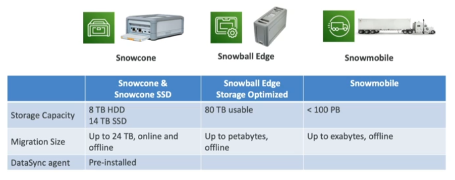

Snow Family are a family of data migration services that AWS offers, it consists of physical devices and has two main use cases:
1. Migrate data into/out of AWS
2. Data at the edge (Edge Computing)

## Data Migration
---
- Challenges Snow devices overcome
	- Limited connectivity
	- Limited bandwidth
	- High network cost
	- Shared bandwidth (can't maximize the line)
	- Connection stability
- As a rule of thumb, if it takes more than a week to transfer data, use Snow devices
### Data Migration Usage Process
1. Request Snowball device from AWS console for delivery
2. Install snowball client /AWS OpsHub on your servers
3. Connect the snowball to your servers and copy files using the client
4. Ship back the device when you're done (goes to the right AWS facility)
5. Data will be loaded into an [[S3]] bucket
6. Snowball is completely wiped

## Edge Computing
---
- Process data while it's being created on an edge location 
	- Edge Locations
		- Limited / no internet access
		- Limited / no easy access to computing power
		 - E.g.: A truck on road, ship on sea, mining station underground, etc...
- Use cases
	- Preprocess data
	- Machine Learning at the edge locations
	- Transcoding media streams
- Eventually the device can be shipped back to AWS (for transfering data for example)

### Snow Family - Edge Computing
- Snowcone & Snowcone SSD (smaller)
	- 2 CPUs, 4 GB of memory, wired or wireless access
	- USB-C power using a cord or optional battery
- Snowball Edge - Compute Optimized
	- 104 vCPUs, 416 GiB of RAM
	- Optional GPU (useful for video processing or machine learning)
	- 28TB NVMe or 42TB HDD usable storage
	- Storage Clustering availbale (up to 16 nodes)
- Snowball Edge - Storage Optimized
	- Up to 40 vCPUs, 880GiB of RAM, 80TB storage

- All of the run [[EC2 (Elastic Compute Cloud)]] instances and [[AWS Lambda]] functions using (AWS IoT Greengrass)
- Long-term deployment options: 1 and 3 years discounted pricing

## AWS Ops Hub
---
- Software installed in computer/laptop to manage Snow devices
	- Unlocking and configuring single or clustered devices
	- Transfer files
	- Laung and manage instances running on Snow Family devices
	- Monitor device metrics (storage capacity, active instances on your device)
	- Launch compatible AWS services on your devices (e.g: EC2 instances, DataSync, [[Elastic File System (EFS)]])