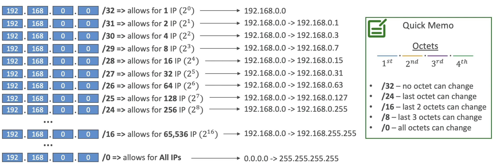

---
tags:
  - Network
---
- Classless Inter-Domain Routing - a method for allocating IP addresses
- Used in [[Security Group]] rules and AWS networking in general
- They help to define an IP address range, for example:
	- `WW.XX.YY.ZZ/32` -> one IP
	- `0.0.0.0/0` -> all IPs
	- `192.168.0.0/26` -> 192.168.0.0 - 192.168.0.63 (64 IPs)

## CIDR Components
---
- Base IP
	- Represents an IP contained in the range (XX.XX.XX.XX)
- Subnet Mask
	- Defines how many bits can change in the IP
	Can take two forms
	- /8 <-> /255.0.0.0
	- /16 <-> 255.255.0.0
	- /24 <-> 255.255.255.0
	- /32 <-> 255.255.255.255

### Subnet Mask
- Subnet mask basically allows part of the underlying IP to get additional next values from the base IP

- You can check [this site](https://cidr.xyz/) to help calculate CIDRs