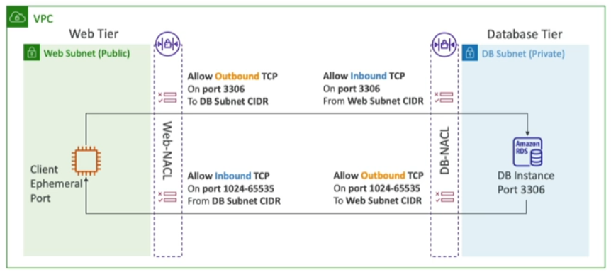

- NACL are like a firewall which control traffic to and from a [[Subnet]]
- One NACL per subnet, new subnets are assigned the __Default NACL__
- You define rules
	- Rules have a number (1 - 32766), higher precedence with a lower number
	- First rule to match will drive the decision
		- Example: You define #100 ALLOW 10.0.0.10/32 and #200 DENY 10.0.0.10/32, the IP address will be alloweds because 100 has a higher precedence over 200
	- The last rule is an asterisk (\*) and denies the a request is case of no rule match
	- AWS recommends adding rules by increment of 100 (so it's easier to create rule in between)
- Newly created NACLs will deny anything
- NACLs are a great way of blocking specific IP address at the subnet level

## Default NACL
---
- Accepts everything inbound/outbound with the subnets it's associated with
- Do NOT modify the Default NACL, instead create custom NACLs

## Ephemeral Ports
---
- For any two endpoints to establish a connection, they must use ports
- Clients connected to a _defined port_ and expect a response on an _ephemeral port_
- Different Operation Systems uise different port ranges, examples
	- IANA & MS Windows 10 -> 49.152 - 65.535
	- Many Linux Kernels -> 32.768 - 60.999

## NACL with Ephemeral Ports
---

More on NACL and [ephemeral ports](https://docs.aws.amazon.com/vpc/latest/userguide/vpc-network-acls.html)

Tip: Create NACL rules for each target subnet [[CIDR]]

## [[Security Group]] vs. NACLs
---

|Security Group|NACL|
|---|---|
|Instance level|Subnet level|
|Allow rules only|Allow rules and deny rules|
|__Stateful__: return traffic is automatically allowed regardless of any rules|__Stateless__: return traffic must be explicitly allowed by rules (ephemeral ports)|
|All rules are evaluated before deciding whether to allow traffic|Rules are evaluated in order (low to high), first match wins| 
|Applies to an [[EC2 (Elastic Compute Cloud)]] instance when specified by someone|Automatically applies to all EC2 instances in the subnet that it's associated with|
