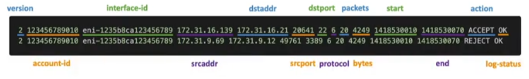

- Capture information about IP traffic going into your interfaces
	- VPC Flow Logs
	- [[Subnet]] Flow Logs
	- [[ENI (Elastic Network Interfaces)]] Flow Logs
- Helps to monitor & troubleshoot connectivity issues
- Flow logs data can go to [[S3]], [[CloudWatch]] Logs, [[Kinesis Data Firehose]]
	- Captures network information from AWS managed interfaces too: [[ELB (Elastic Load Balancer)]], [[RDS (Relational Database Service)]], [[RedShift]], WorkSpaces, [[NAT Gateway]], [[Transit Gateway]], etc...

- srcaddr & dstaddr - identify problematic IP
- srcport & dstport - identify problematic ports
- Action - success or failure of the request due to [[Security Group]] / [[NACL (Network Access Control List)]]
- Can be used for analytics on usage patterns or malicious behavior
- Query VPC Flow logs using [[Athena]] on S3 or [[CloudWatch Logs]] insights
- [Flow Logs example](https://docs.aws.amazon.com/vpc/latest/userguide/flow-logs-records-examples.html)
